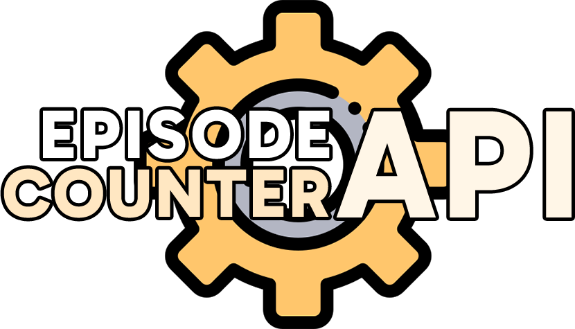

<h1 width="100%" align="center">
  

</h1>

  
  
  
  

  

  <h3>You're reading in:</h3>
  
  

<h2 id="resume">Resume</h2>
<blockquote>
  <h3 id="episode-counter-v1">Episode Counter API</h3>
  

    Episode Counter API is a tool created with the aim of improving the original Episode Counter. Moving from a desktop-only environment to a tool that does not require the client to have the JVM and that can be implemented on the web, mobile, among others.
  

</blockquote>

This is version 2.0 of Episode Counter API, which follows the same principles as its first version, however with fundamental changes for the tool to function properly.

